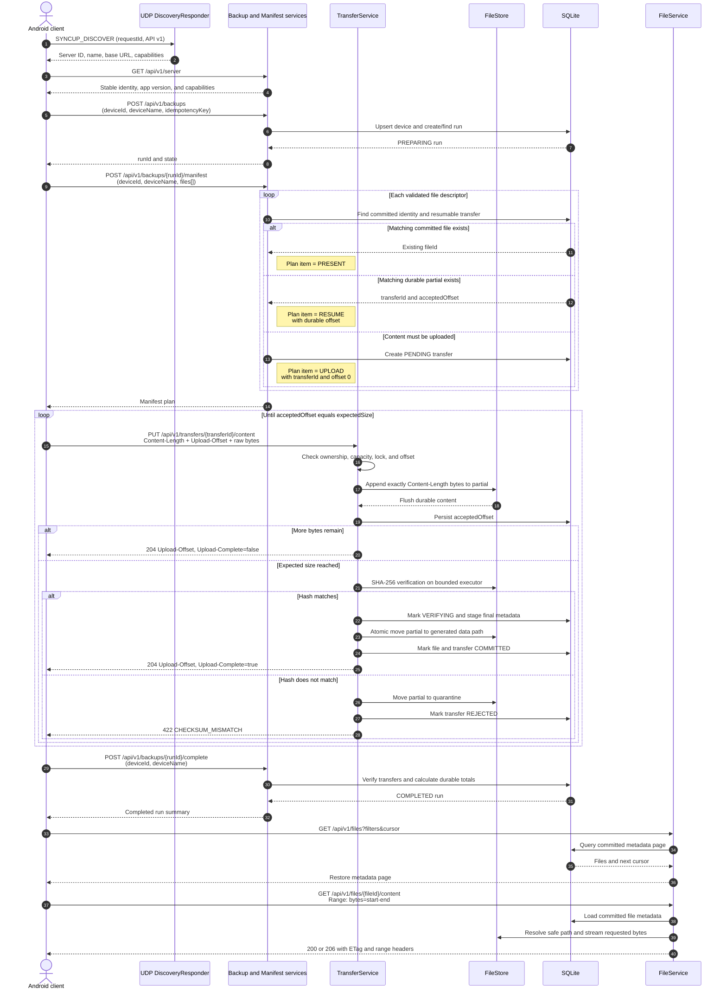

# SyncUp Spring Server — Design and Implementation Plan

## 1. Purpose

The SyncUp server is a Spring Boot application running on a laptop or desktop. It announces itself on the private network, exposes the versioned SyncUp HTTP API, stores files safely, tracks metadata, and serves restore downloads.

This document owns server runtime, modules, persistence, storage, and operations. The public HTTP and discovery contracts live in [backup-system-design.md](backup-system-design.md); Android behavior lives in [android-client-design.md](android-client-design.md).

> **Current implementation decision:** version 1 runs only on a trusted private LAN and has no pairing, authentication, authorization, or Spring Security. The security model in the shared system design is a future target, not part of the first server implementation.

## 2. Version 1 Scope

### In scope

- Spring Boot 4.1 application on Java 25 LTS
- Executable JAR launched from a terminal
- Spring MVC HTTP API with embedded Tomcat
- UDP discovery responder managed by the Spring lifecycle
- SQLite metadata through Spring JDBC
- Flyway SQL migrations
- Configurable local backup root
- Incremental backup through manifest comparison
- Streaming, resumable HTTP uploads
- HTTP Range restore downloads
- SHA-256 verification and atomic file commit
- Actuator health/metrics and structured console logs

### Deferred

- Browser-based administration UI
- Access over the internet
- Multiple-server federation
- WebFlux/reactive persistence
- Cross-device physical deduplication
- File version history
- At-rest encryption
- PIN pairing, authentication, authorization, and token management
- TLS/HTTPS
- Native executable packaging

## 3. Why Spring MVC

Spring MVC is the initial server stack because:

- The expected number of concurrent LAN devices is small.
- SQLite and filesystem access are blocking.
- Streaming servlet request/response bodies is sufficient for large files.
- Validation, exception mapping, configuration, and Actuator integrate directly.
- The public API stays ordinary HTTP and is straightforward to consume with Android OkHttp.

WebFlux does not automatically make a single file transfer faster. It becomes worth considering only if measurement shows a concurrency or thread-utilization problem. Java 25 virtual threads are also an optional measured optimization, not an initial requirement.

## 4. Build and Module Layout

Add a separate Gradle application module named `server`. The Android `app` module and server may share pure Java DTO/test fixtures later, but the server must not depend on Android classes.

```text
backup-app/
├── app/                         Android application
├── server/                      Spring Boot application
│   ├── build.gradle.kts
│   └── src/
│       ├── main/
│       │   ├── java/com/hitstudio/syncup/server/
│       │   │   ├── SyncUpServerApplication
│       │   │   ├── config/
│       │   │   ├── discovery/
│       │   │   ├── backup/
│       │   │   ├── transfer/
│       │   │   ├── file/
│       │   │   ├── persistence/
│       │   │   └── support/
│       │   └── resources/
│       │       ├── application.yml
│       │       └── db/migration/
│       └── test/
└── docs/
```

Use package-by-feature at the top level. Within a feature, keep controllers, DTOs, services, and repositories close together. This is a modular monolith: one deployable process with explicit internal boundaries.

## 5. Spring Stack

| Capability | Choice |
|---|---|
| Runtime | Spring Boot 4.1, Java 25 |
| HTTP | `spring-boot-starter-web` / Spring MVC |
| Authentication | None for now; trusted private LAN only |
| Validation | Jakarta Bean Validation |
| Metadata access | Spring JDBC `JdbcClient` |
| Database | Xerial SQLite JDBC |
| Migrations | Flyway with SQLite support |
| Serialization | Jackson managed by Spring Boot |
| Testing | Skip UTs for now |

Do not use JPA/Hibernate in version 1. The schema is small, manifest queries and state transitions benefit from explicit SQL, and Spring JDBC avoids unnecessary ORM and SQLite dialect complexity.

## 6. Component Responsibilities

| Component | Responsibility |
|---|---|
| `SyncUpServerApplication` | Start Spring Boot and register shutdown behavior |
| `SyncUpProperties` | Bind and validate all `syncup.*` configuration |
| `ServerIdentityService` | Generate and retain stable server ID/name |
| `DiscoveryResponder` | Receive bounded UDP discovery messages and return the HTTP endpoint |
| `BackupController` | Create runs, accept manifest batches, return plans, cancel/complete runs |
| `ManifestService` | Validate descriptors and compare them with committed metadata |
| `TransferController` | Stream upload segments and return durable offsets |
| `TransferService` | Enforce device/run association, offset, size, lifecycle, and commit rules |
| `FileController` | List metadata and stream full/range downloads |
| `FileStore` | Generate safe paths, manage partials, verify hashes, and atomically move files |
| `Jdbc*Repository` | Execute explicit SQL and map persistence records |
| `StorageHealthIndicator` | Report storage writability and free-space state |
| `PartialCleanupJob` | Apply retention policy to abandoned partial transfers |

Controllers validate transport input and delegate. They must not construct filesystem paths or contain SQL. Repositories must not implement backup policy.

## 7. Configuration

Primary configuration:

```yaml
server:
  address: 0.0.0.0
  port: 8500

spring:
  application:
    name: syncup.syncup.syncup-server
  datasource:
    url: jdbc:sqlite:${syncup.syncup.syncup.storage.root}/syncup.syncup.syncup.db
    driver-class-name: org.sqlite.JDBC
  flyway:
    enabled: true
  servlet:
    multipart:
      enabled: false

syncup:
  server:
    name: My Laptop
  discovery:
    enabled: true
    port: 9999
    max-datagram-bytes: 2048
  storage:
    root: ./syncup.syncup.syncup-data
    minimum-free-bytes: 5368709120
    partial-retention: 7d
  transfer:
    segment-bytes: 8388608
    max-segment-bytes: 4294967296
    max-file-bytes: 1099511627776
    max-concurrent-per-device: 2
    max-concurrent-total: 4
    idle-timeout: 10m
  manifest:
    max-batch-files: 500
    max-body-bytes: 4194304

management:
  endpoints:
    web:
      exposure:
        include: health,info
  endpoint:
    health:
      show-details: never
```

Use typed `@ConfigurationProperties` with startup validation. Environment variables or command-line flags may override YAML.

Startup validation must confirm:

- Java/runtime and configuration are supported.
- HTTP and discovery ports are available.
- Storage root exists or can be created and is writable.
- SQLite can be opened and migrations succeed.
- Storage root has the configured safety margin.
- Stable server identity can be loaded or created.

Because authentication is deferred, expose only non-sensitive health and application information. Metrics, environment, configuration, and administrative endpoints must remain disabled.

## 8. Server Lifecycle

Startup order:

1. Bind and validate configuration.
2. Acquire a process lock for the server data directory.
3. Load or create stable server identity.
4. Initialize SQLite and apply Flyway migrations.
5. Reconcile interrupted filesystem/database state.
6. Start embedded HTTP server.
7. Start UDP discovery responder after the application is ready.
8. Print server name, reachable addresses, port, storage root, and a trusted-LAN warning.

Shutdown order:

1. Stop discovery responses.
2. Reject creation of new backup runs.
3. Allow active HTTP requests a bounded grace period.
4. Flush durable offsets and mark active runs interrupted.
5. Close database and release process lock.

The discovery responder should implement Spring lifecycle interfaces or react to application ready/closing events; it should not create an unmanaged immortal thread.

## 9. Persistence Model

SQLite uses WAL mode, foreign keys, a busy timeout, and short transactions. Filesystem streaming never occurs inside a long database transaction.

### `server_identity`

| Column | Purpose |
|---|---|
| `server_id` | Stable UUID |
| `server_name` | User-visible name |
| `created_at` | First initialization |

### `devices`

| Column | Purpose |
|---|---|
| `device_id` (PK) | Stable client-generated UUID |
| `device_name` | User-visible name |
| `first_seen_at` | First accepted request |
| `last_seen_at` | Last accepted request |

### `backup_runs`

| Column | Purpose |
|---|---|
| `run_id` (PK) | Server-issued UUID |
| `device_id` (FK) | Backup owner |
| `idempotency_key` | Retry identity |
| `state` | Preparing, planned, transferring, completed, cancelled, interrupted, or failed |
| `started_at`, `completed_at` | Timestamps |
| `file_count`, `byte_count` | Planned/final totals |

Use a uniqueness constraint on `(device_id, idempotency_key)`.

### `manifest_entries`

| Column | Purpose |
|---|---|
| `run_id` (FK) | Owning run |
| `client_file_key` | Client source identity |
| `display_name`, `relative_path` | Untrusted source metadata |
| `media_type`, `mime_type` | Filtering/display metadata |
| `size_bytes`, `sha256` | Content identity |
| `captured_at`, `modified_at` | Source timestamps |
| `disposition` | Present, upload, resume, or rejected |

Use uniqueness on `(run_id, client_file_key)`.

### `files`

| Column | Purpose |
|---|---|
| `file_id` (PK) | Server UUID |
| `device_id` (FK) | Logical owner |
| `client_file_key` | Most recent client source identity |
| `original_name` | Display name |
| `original_relative_path` | Informational source path |
| `media_type`, `mime_type` | Logical type |
| `size_bytes`, `sha256` | Verified content identity |
| `captured_at`, `modified_at` | Source metadata |
| `stored_path` | Path relative to storage root |
| `backed_up_at` | Commit time |
| `status` | Committed, quarantined, missing, or deleted |

Use a unique committed-file constraint on `(device_id, sha256, size_bytes)`. Index restore filters such as `(device_id, captured_at)` and `(device_id, media_type)`.

### `transfers`

| Column | Purpose |
|---|---|
| `transfer_id` (PK) | Upload UUID |
| `run_id`, `device_id` | Ownership |
| `client_file_key` | Manifest link |
| `partial_path` | Server-generated relative path |
| `expected_size`, `expected_sha256` | Commit contract |
| `accepted_offset` | Durable sequential byte count |
| `state` | Pending, partial, verifying, committed, rejected, expired |
| `last_activity_at`, `expires_at` | Recovery/retention |

## 10. Storage Layout

```text
syncup-data/
├── data/
│   └── <device-name>/
│       └── <original-name>
├── partial/
│   └── <transfer-id>.part
├── quarantine/
├── syncup.db
├── server-id
└── syncup.lock
```

Rules:

- Treat filenames and relative paths as untrusted metadata.
- Generate every physical storage path on the server.
- Reject traversal, absolute paths, control characters, invalid sizes, and invalid hashes.
- Reject unsafe `deviceName` folder names before using them on disk.
- Write only under `partial/` until expected size and SHA-256 are verified.
- Atomically move verified content into the `data/<device-name>/` directory.
- Mark metadata committed only after the move succeeds.
- Preserve the original filename as the file leaf; if the same path already exists with matching bytes, reuse it, otherwise reject the collision instead of overwriting an existing file.
- Never expose database/internal paths through file APIs.

## 11. Discovery

`DiscoveryResponder` uses `DatagramChannel` or `DatagramSocket` on the configured UDP port.

Responsibilities:

- Bind after the Spring application is ready.
- Read no more than the configured datagram limit.
- Parse only the discovery DTO.
- Validate protocol version and request ID.
- Determine a reachable local address for the response.
- Reply by unicast with server ID, name, HTTP port, API version, and capabilities.
- Rate-limit malformed/repeated traffic.
- Close promptly during application shutdown.

Discovery remains independent from Spring MVC because it is UDP, but its configuration, lifecycle, logging, and health are managed by Spring beans.

## 12. Trusted-LAN Mode

The first server implementation has no application-level security:

- No PIN pairing
- No bearer tokens
- No Spring Security dependency
- No per-device authorization
- No TLS/HTTPS

The client includes its stable `deviceId` in backup requests. The server uses it only to organize metadata and ownership; it is not proof of identity.
The client also sends `deviceName`. The server stores files under a `data/<device-name>/` directory and keeps the original display name as the file leaf, while also keeping the latest display name in the `devices` table.

All SyncUp API endpoints are reachable by devices that can access the server's LAN address. Any such device could inspect or restore any backup if it knows or discovers the API. Therefore:

- Run the server only on a trusted home/private network.
- Do not expose port `8500` through router forwarding, a public IP, or a public tunnel.
- Keep detailed Actuator and administrative endpoints disabled.
- Continue validating request sizes, identifiers, upload offsets, filenames, and generated paths. Deferring authentication does not relax input or storage safety.

The API should avoid assumptions that block future security. Device IDs remain explicit, and authentication/authorization can later be added at the HTTP boundary without changing file-transfer or persistence services.

## 13. Backup and Manifest Handling

1. `POST /backups` creates or returns an idempotent run.
2. Manifest batches are validated using Bean Validation plus domain checks.
3. Each batch is written in a short transaction.
4. Planning compares `(device_id, sha256, size_bytes)` with committed files.
5. Existing partial transfers are reconciled by expected identity.
6. Server checks free-space budget before offering uploads.
7. Plan returns `PRESENT`, `UPLOAD`, `RESUME`, or `REJECTED`.
8. Completing the run calculates durable totals from persisted state.

Manifest and backup limits:

- Maximum files per manifest submission: `500`
- Maximum JSON body size: `4 MiB`
- Maximum file size: `1 TiB`
- Multiple backup runs can exist, but active upload streams are capped at `2` per device and `4` total
- Default segment size: `8 MiB`
- Maximum segment size: `4 GiB`
- Supported logical media types: `IMAGE`, `VIDEO`, `AUDIO`, `DOCUMENT`, `OTHER`
- `displayName` must be a plain filename without path separators or dot segments
- `relativePath` must be a safe relative path with no traversal segments
- `mimeType` must resemble a normal type/subtype value
- SHA-256 must be a 64-character hexadecimal digest
- No duplicate `clientFileKey` within a run

### End-to-end backup and restore sequence

The sequence below shows the normal path plus the important deduplication,
resume, checksum-failure, and range-restore branches. SQLite interactions are
short metadata transactions; request and response bodies containing file content
are streamed and never held in those transactions.



## 14. Streaming Upload Handling

`PUT /api/v1/transfers/{transferId}/content` consumes the raw servlet input stream.

Processing order:

1. Load the transfer and verify its declared device/run association.
2. Parse and validate `Content-Length` and `Upload-Offset`.
3. Acquire a per-transfer lock.
4. Re-read authoritative transfer state after acquiring the lock.
5. Reject offset mismatch with `409` and current offset.
6. Confirm storage safety margin.
7. Stream exactly the declared bytes to the partial file.
8. Flush the file content according to durability policy.
9. Update `accepted_offset` in a short transaction.
10. Return `204` with the durable `Upload-Offset`.
11. At expected size, transition to verifying, calculate SHA-256, and commit atomically.

Important constraints:

- Multipart support is disabled; no `MultipartFile`.
- Do not call APIs that materialize the request body as `byte[]`.
- A request exceeding configured segment size receives `413`.
- An early EOF or excess byte receives an error and does not advance offset.
- Only one writer may append to a transfer at once.
- Hashing may be incremental or performed after final byte receipt; version 1 favors the simpler post-upload verification.
- Verification work uses a bounded executor so several large files cannot starve the server.

## 15. Range Download Handling

`GET /api/v1/files/{fileId}/content`:

1. Loads the requested file and checks that its status is committed.
2. Resolves the stored relative path under the configured root.
3. Validates that the committed file still exists and matches expected size.
4. Parses at most one byte range in version 1.
5. Streams `200 OK` or `206 Partial Content`.
6. Includes `Content-Length`, `Accept-Ranges`, `ETag`, and `Content-Range` when applicable.

Reject invalid/unsatisfiable ranges with `416`. The controller must not expose an absolute path in headers or errors.

## 16. Transactions and Filesystem Consistency

SQLite and filesystem operations cannot share one atomic transaction, so commits follow an explicit state machine:

```text
PARTIAL
  → VERIFYING
  → file moved to final path
  → COMMITTED in SQLite
```

Recovery handles the gaps:

- Final file exists, DB says `VERIFYING`: verify identity and finish commit.
- DB says `COMMITTED`, final file missing: mark `MISSING` and report unhealthy.
- Partial file exists without live transfer row: quarantine or delete by retention policy.
- Transfer row offset differs from partial size: choose the smaller safe offset and truncate excess bytes.

No HTTP success response may claim `COMMITTED` before both final file and metadata are durable.

## 17. Concurrency and Backpressure

- Limit concurrent transfers globally and per device.
- Allow one writer per transfer.
- Bound hashing executor and cleanup work.
- Keep database write transactions short.
- Configure SQLite busy timeout and retry only safe transaction failures.
- Return `429` or `503` with `Retry-After` when capacity is exhausted.
- Stream files with reusable buffers.
- Do not queue an unbounded number of manifest entries or verification jobs.

Start with standard Spring MVC platform threads. Benchmark representative backup and restore workloads before considering:

```yaml
spring:
  threads:
    virtual:
      enabled: true
```

If virtual threads are evaluated, test pinned-thread behavior, database contention, throughput, and shutdown semantics rather than assuming improvement.

## 18. Failure Recovery and Cleanup

At startup:

- Reconcile `partial/`, `data/`, and SQLite state.
- Mark abandoned active runs interrupted.
- Preserve valid recent partial files for resume.
- Quarantine inconsistent partial/final files.
- Surface committed metadata whose file is missing.

Scheduled maintenance:

- Expire abandoned transfers.
- Delete or quarantine stale partials according to policy.
- Prune idempotency records after their safe retry window.
- Recalculate storage health.

During operation:

- Translate domain errors to stable `ProblemDetail` responses.
- Treat malformed client input as request failure, never process failure.
- Keep already committed files valid after disk-full or database-lock events.
- Stop discovery and HTTP acceptance cleanly during shutdown.

## 19. Observability and Administration

Actuator:

- Expose minimal `health` to the LAN.
- Include database and custom storage health indicators.
- Do not expose detailed health, metrics, config, or administrative information while authentication is absent.
- Avoid exposing environment variables or secrets.

Metrics:

- Active transfers
- Bytes uploaded/downloaded
- Transfer duration/rate
- Manifest planning duration
- Hash verification duration/failures
- Partial/committed file counts
- Free storage

Structured logs:

- Startup/shutdown and configuration summary without secrets
- Discovery and device request events
- Backup run summaries
- Transfer outcome and stable failure code
- Recovery and storage/database warnings

Never log request bodies, full personal paths, or file bytes.

Initial administration can use startup flags plus narrowly scoped local-only endpoints or commands. A browser administration UI is deferred.

## 20. Server Delivery Slices

### S1 — Bootstrap and discovery

- Gradle Spring Boot module
- Typed configuration and validation
- Stable identity
- Flyway/SQLite bootstrap
- UDP discovery
- Actuator health

**Done when:** the Android client discovers a running server and `GET /api/v1/server` reports the same stable identity.

### S2 — Backup API foundation

- Device registration/first-seen metadata
- Backup run resources
- Manifest batch validation
- Consistent Problem Details responses
- Trusted-LAN warning at startup

**Done when:** a discovered client can create a backup run and submit a valid manifest without pairing.

### S3 — First complete backup

- Backup run and manifest endpoints
- Planning/dedup
- Single streaming upload
- SHA-256 verification and atomic commit

**Done when:** one file is stored intact and a repeated manifest reports it `PRESENT`.

### S4 — Restore

- Cursor/filter file listing
- Full and range download

**Done when:** the Android client restores a committed file and resumes an interrupted download.

### S5 — Resilience and speed

- Segmented upload resume
- Startup reconciliation
- Bounded parallel file transfers
- Metrics and failure injection
- Measured virtual-thread decision

**Done when:** a server restart during a large upload allows safe resume without corrupting committed data.

## 21. Server Test Plan

- Unit: configuration, path safety, manifest comparison, offset rules
- MVC: request validation, Problem Details, range responses
- Persistence: Flyway migrations, uniqueness races, busy handling, transaction rollback
- Storage: partial writes, checksum mismatch, atomic move, reconciliation
- Integration: discover, upload, duplicate manifest, interrupted resume, list, download
- Failure injection: disk full, short body, excess body, database lock, abrupt client/server exit
- Safety: traversal, oversized bodies, invalid cross-device associations, actuator exposure
- Performance: large-file throughput, concurrent devices, hashing cost, heap, threads, open handles

## 22. Server Open Decisions

- Pin the exact Spring Boot 4.1 patch release when implementation begins.
- Confirm Flyway dependency coordinates for SQLite in the implementation spike.
- Define maximum segment/file/manifest sizes and all timeouts.
- Define partial and idempotency retention windows.
- Decide whether local administration uses console commands, localhost-only endpoints, or both.
- Decide from benchmarks whether virtual threads are beneficial.
- Revisit pairing, authentication, authorization, and TLS before allowing use outside a trusted private LAN.
